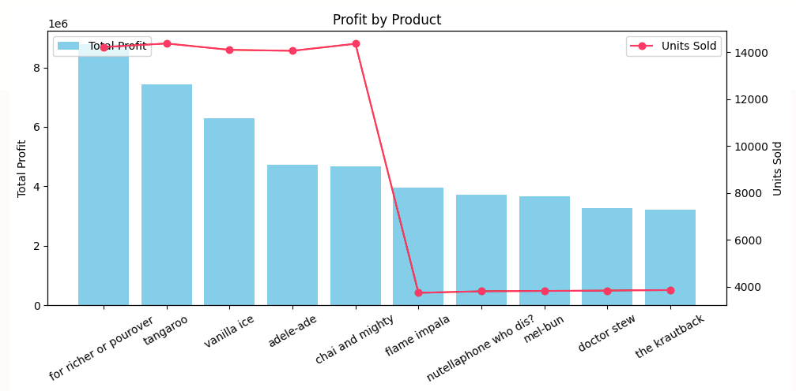
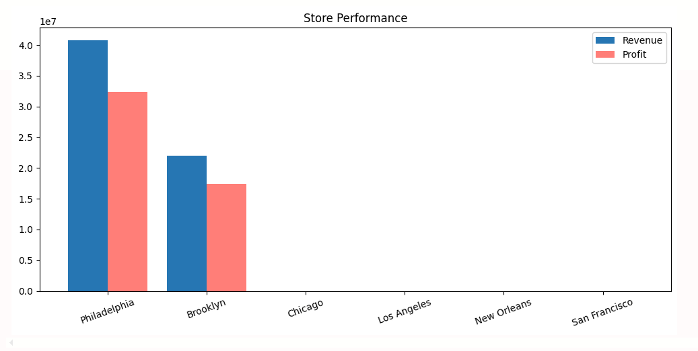
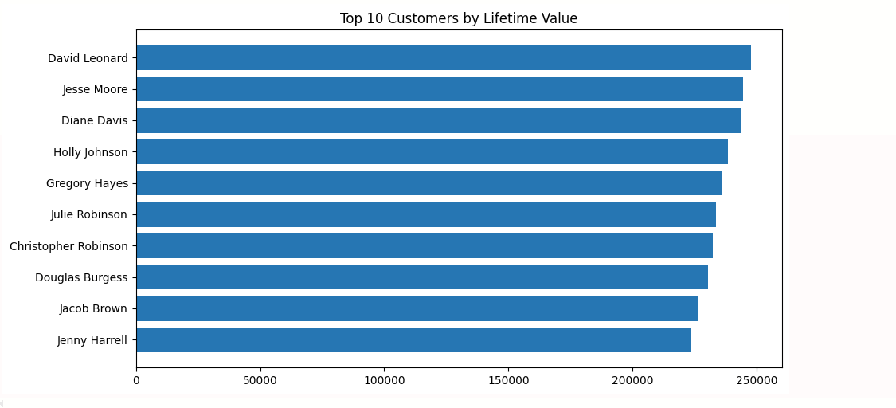

# Jaffle Shop Analytics Engineering Pipeline

This is a data architecture using **dbt Core** and **DuckDB** to model raw e-commerce data DBT curated data of **jaffle shop** into an optimized, tested dimensional warehouse.

---

## Project Overview

This project ingests raw transaction seeds and refines them through a modular **Medallion Architecture**, giving concise, data-backed analysis.

```
   [Raw Seeds]           [Staging Layer]          [Intermediate Layer]         [Marts Layer]
  Unstructured/Raw  ──►   Sanitized Views   ──►     Heavy Math/Joins    ──►   Physical Gold Tables
   (Bronze Layer)          (Silver Prep)             (Silver Engine)             (Gold Layer)

```

The stack is entirely **local-first**, running on an embedded DuckDB instance (`capstone_dev.duckdb`). This guarantees zero cloud computing costs during development, near-instant compilation times, and seamless downstream handoffs to local data science environments.

---

## 📂 Project Structure

The project design strictly segregates data state and transformation concerns:

```text
CAPSTONE-PROJECT/
├── capstone_dev.duckdb       # Local-first data warehouse file
├── dbt_project.yml           # Global project configuration
├── analysis.ipynb            # Downstream Python visualization hub
├── models/
│   ├── staging/              # Bronze Layer: Source-conformed clean views
│   │   ├── staging.yml       # Primary key & constraints testing
│   │   └── stg_*.sql         
│   ├── intermediate/         # Silver Layer: Non-exposed metric prep (Ephemeral)
│   │   └── int_*.sql         
│   └── marts/                # Gold Layer: Exposed Fact and Dimension tables
│       ├── marts.yml         # Referential integrity & governance testing
│       └── *.sql             
└── seeds/                    # Raw Jaffle shop CSV ingestibles

```

---

##  Model Explantion

### 1. Staging Layer (Bronze)

* **Materialization:** `view`
* **Objective:** Clean, rename, cast types, and establish primary keys. These models map 1:1 with raw sources and perform no aggregate math.

| Model Name | Source Entity | Key Actions Taken |
| --- | --- | --- |
| `stg_customers` | `raw_customers` | Sets uniform string casing; names unique `customer_id`. |
| `stg_orders` | `raw_orders` | Renames primary identifier to `order_id`; standardizes timestamp as `orders_at`. |
| `stg_items` | `raw_items` | Extracts the line-item grain; maps granular receipts to products. |
| `stg_products` | `raw_products` | Types retail prices (`product_price`) and operational product costs (`product_cost`). |
| `stg_stores` | `raw_stores` | Sanitizes geographic storefront naming boundaries. |
| `stg_supplies` | `raw_supplies` | Isolates backend wholesale vendor invoice costs. |

---

### 2. Intermediate Layer (Silver)

* **Materialization:** `ephemeral`
* **Objective:** The engine room. This layer isolates resource-intensive groupings (`SUM`, `AVG`, `COUNT`) and complex multi-table joins. By grouping data by business keys here, we prevent duplicate code and ensure a single definition for metrics.
* **`int_order_items_joined`**
* *The Grain:* One row per individual item sold inside a basket.
* *Purpose:* Flattens transaction items with metadata from orders and menu pricing from products. This sets up row-level revenue (`item_revenue`) and cost mapping (`item_cost`).


* **`int_product_sales_aggregated`**
* *The Grain:* One row per unique product item.
* *Purpose:* Pre-aggregates cumulative sales volumes, gross incoming revenue, and gross item profits.


* **`int_store_costs_aggregated`**
* *The Grain:* One row per retail storefront location.
* *Purpose:* Rolls up material overhead and inventory vendor supply expenses.


* **`int_customer_order_history`**
* *The Grain:* One row per customer.
* *Purpose:* Pre-calculates customer loyalty lifespans, recording purchase counts and sequence markers.


---

### 3. Marts Layer (Gold)

* **Materialization:** `table`
* **Objective:** The presentation layer. These tables are physically written to disk as a star schema database. They serve as the single source of truth for downstream tools.

#### Dimensions (`dim_`) & Customer Marts

* **`dim_products`**
* *Business Use Case:* Menu Optimization. Joins base menu items to `int_product_sales_aggregated` to surface total margins, sorted dynamically by highest net profitability.


* **`dim_stores`**
* *Business Use Case:* Regional Franchise Performance. Combines store infrastructure logs with performance metrics to calculate net profitability and true **Profit Margin Percentages** per location.


* **`mart_most_valuable_customer`**
* *Business Use Case:* Loyalty and VIP Marketing. Reuses intermediate aggregations to map descriptive customer entities with their complete calculated **Lifetime Value (LTV)** and historical average order size.


#### Facts (`fct_`)

* **`fct_orders`**
* *The Grain:* One row per distinct transaction receipt.
* *Business Use Case:* High-level Executive Financial Reporting. Aggregates granular item-level details from `int_order_items_joined` up to the master order boundary. Represents the central numeric transaction ledger tracking net margins over time.


---

## Dependency Graph & Lineage

The clean abstraction from source data to business delivery ensures a directed acyclic graph (DAG) with zero circular dependencies or repetitive code block calculations.

### dbt Lineage Graph Visual

> **Developer Action Required:** Generate your lineage graph using `dbt docs generate && dbt docs serve`, take a screenshot, and save it to your project path. Update the link below.

---

## Automated Data Governance

Data reliability is actively guaranteed by running automated quality gates over the pipeline components via assertions declared in configuration scripts.

* **Primary Constraints:** Every primary key across the staging and mart boundaries is verified as `unique` and `not_null`.
* **Referential Integrity:** Mart execution validates database foreign keys using `relationships` checking. This guarantees that every transaction mapped to a `customer_id` or `store_id` accurately references a legitimate master entry, eliminating ghost entries.

```bash
# Execute full testing suite
dbt test

```

```text
Finished running 21 data tests in 0 hours 0 minutes and 0.66 seconds.
Completed successfully
Done. PASS=21 WARN=0 ERROR=0 SKIP=0 TOTAL=21

```

---

## Downstream Consumption (`analysis.ipynb`)

Rather than maintaining heavy business logic inside visualization engines, Jupyter analysis environment remains clean. The file `analysis.ipynb` leverages high-speed local data frame pipelines via Pandas to connect to `capstone_dev.duckdb`, loading fully compiled tables for immediate insight generation using Matplotlib.

### Core Visual Analytics & Business Answers Surfaced


#### 1. Menu Financial Matrix (Net Profit by Product)

- **Core Analytics Question:** Which items drive our bottom-line profit, and are they volume-driven or margin-driven?

 

- **Insights:** * **The Volume Drivers:** `for richer or pourover` is the ultimate cash cow, netting close to $9M in total profit, closely followed by `tangaroo` and `vanilla ice`. The top five products rely on high-volume consistency, hovering around 14,000 units sold each.
    
    - **The High-Margin Hidden Gems:** An unexpected anomaly appears after `chai and mighty`. Products like `flame impala` through `the krautback` experience a massive drop in demand, selling only around 3,800 units each. However, despite moving less than a third of the volume, they still generate $3M to $4M in total profit.
        
- **Next steps:** These low-volume items possess outstanding unit economics and exceptionally high profit margins. Marketing should actively push these items to increase sales volume, as they will scale profitability significantly faster than the current top-tier products.


#### 2. Regional Performance Matrix (Store Revenue vs Net Margins)



- **Core Analytics Question:** Which geographic storefronts are highly operational, and what are their baseline margins?
    
- **Insights:** * **The Financial Powerhouses:** `Philadelphia` is the company’s highest-performing market, pulling in $40.7M in revenue and netting $32.3M in profit. `Brooklyn` follows as a strong second engine with $21.9M in revenue and $17.4M in profit.
    
    - **The Unit Economics:** Both operational stores display incredible structural efficiency, executing at a nearly identical, highly optimized profit margin (79.4% for Philadelphia and 79.3% for Brooklyn).
        
    - **Data Pipeline / Operational Warning:** `Chicago`, `Los Angeles`, `New Orleans`, and `San Francisco` register absolute zeros across revenue, profit, and margin.
        
- **Next steps:** Investigate upstream data ingestion to determine if transaction seed data for these zero-revenue regions is missing, or confirm with operations if these are impending storefront expansion sites currently waiting for a cold market launch.
    


#### 3. High-Value Consumer Tiering (Top 10 LTV Profiles)



- **Core Analytics Question:** Who are our most valuable customers, and what are their ordering behaviors?
    
- **Insights:**
    
    - **The LTV Leaderboard:** Customer value is tightly clustered at the top tier. `David Leonard` leads the ecosystem with a lifetime value (LTV) of $247,800.00, closely trailed by `Jesse Moore` ($244,400.00) and `Diane Davis` ($243,900.00).
        
    - **The Transactional Outliers (Wholesale Profiles):** While the majority of top spenders have an average transaction ticket size floating around $2,000 per order, a massive structural variance occurs with Holly Johnson and Julie Robinson.
        
- **Next steps:** Holly has an average ticket size of $5,297.78 and Julie maintains an average order value of $5,306.82. Because these represent high-value corporate catering accounts or B2B commercial entities rather than standard retail consumers, the CRM team must immediately separate these corporate buyers into an exclusive account-managed retention program.
